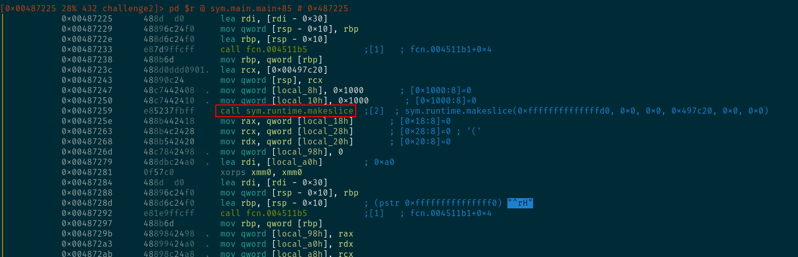
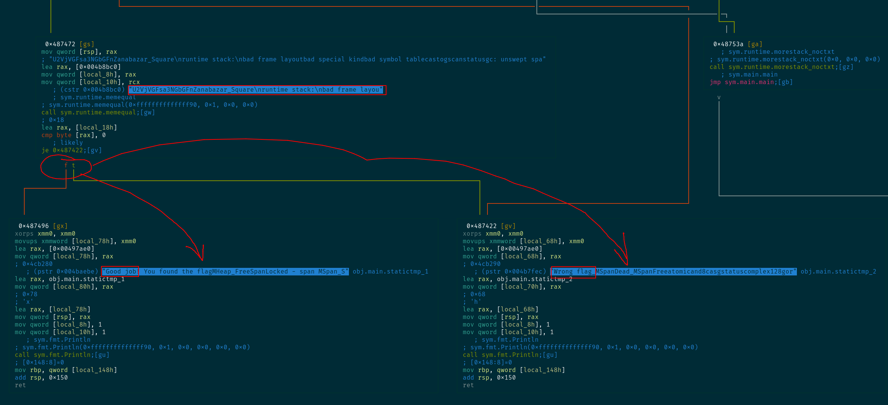
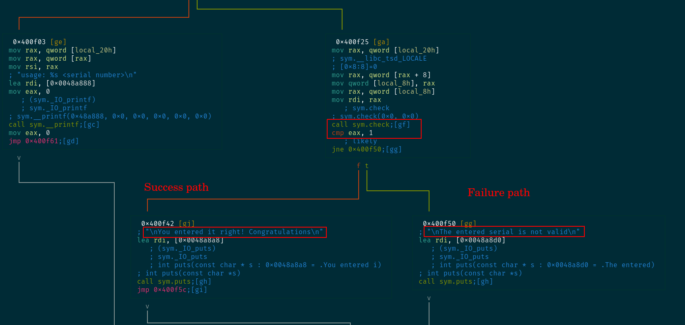
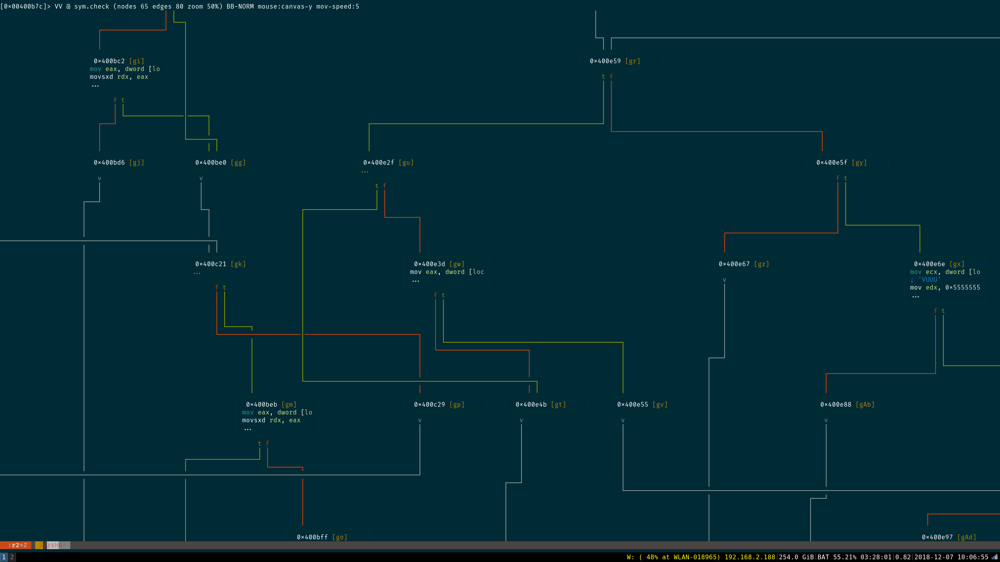
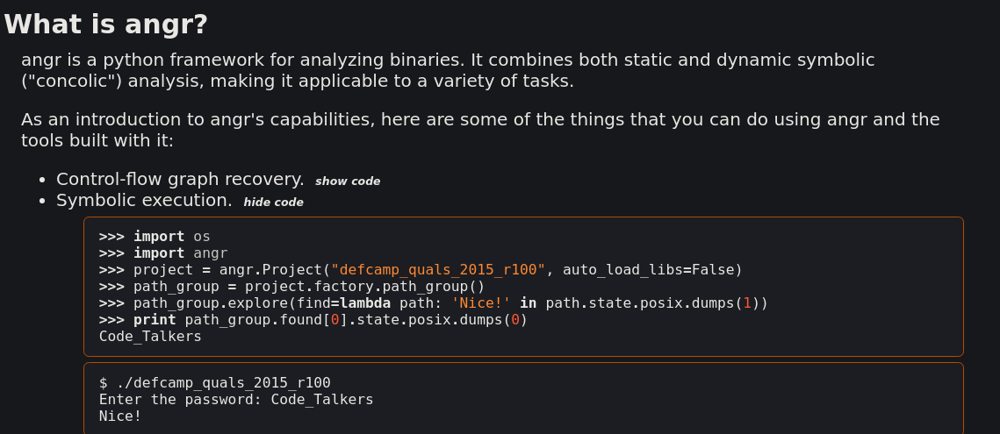

Solved by: [@MalwareCheese](https://twitter.com/malwarecheese)

Also up on: [https://riverbird.co/posts/sectalks0x03.html](https://riverbird.co/posts/sectalks0x03.html)

Challenge \#1
=============

Open-up Wireshark. Right-click any packet and choose \"Follow TCP
Stream\". You\'ll find the flag sent over many packets.

Flag is: **FLAG:385b87afc8671dee07550290d16a8071**

Challenge \#2
=============

    [0] % file challenge2
    challenge2: ELF 64-bit LSB executable, x86-64, version 1 (SYSV), statically linked, Go BuildID=6Rdi132Q4CaVhigo8VXg/IZu9ZeSNp3culgg8mH9n/cSgSNHoa4WWrvKF2fivx/JC1b1rnuLRoE5aM2_NgB, not stripped

    [0] % rabin2 -I challenge2
    Warning: Cannot initialize dynamic strings
    arch     x86
    baddr    0x400000
    binsz    1938452
    bintype  elf
    bits     64
    canary   false
    sanitiz  false
    class    ELF64
    crypto   false
    endian   little
    havecode true
    lang     go
    linenum  true
    lsyms    true
    machine  AMD x86-64 architecture
    maxopsz  16
    minopsz  1
    nx       true
    os       linux
    pcalign  0
    pic      false
    relocs   true
    rpath    NONE
    static   true
    stripped false
    subsys   linux
    va       true

We see it\'s a unstripped ELF binary compiled with Go. I also see that
it\'s statically-linked so decompilation will not be easy through any
framework.

Running it we see:

    cheese@291233 : ~/dev/ctf/sectalks0x03
    [0] % ./challenge2
    Enter text: AAAAA
    Wrong flag

The flag is supplied through a command line argument. Since it\'s
compiled with Go, I\'d rather take a quick look through static analysis
before jumping with a debugger, since I don\'t think it\'ll be easy to
attach GDB to this and understand what\'s happening. I do know that
Radare2 has some support for Go binary decompilation.

We saw that the the binary is statically-linked, Luckily enough, the
binary is simple so running through the main function and grepping for
strings should be sufficient to know where we are.

    [0] % r2 challenge2
    r_config_set: variable 'src.color' not found
    Warning: Cannot initialize dynamic strings
     -- In Soviet Russia, radare2 has documentation.
    [0x00451ec0]> aa
    [Usage: afn newname [off]   # set new name to given function
    WARNING: r_bin_get_vaddr: assertion 'bin && paddr != UT64_MAX' failed (line 1383)
    [x] Analyze all flags starting with sym. and entry0 (aa)
    [0x00451ec0]> afl~main
    0x00428560   33 852          sym.runtime.main
    0x0044d7e0    3 71           sym.runtime.main.func1
    0x0044d830    5 60           sym.runtime.main.func2
    0x004871d0   15 884          sym.main.main
    0x00487550    7 112          sym.main.init
    [0x00451ec0]> 

We see that r2 identified a main function. It didn\'t take too long to
decompile. I don\'t wanna dive too deep into the binary since it\'s
statically-linked.

We see that the name of the functions is sane:
[sym.runtime.makeslice]{.title-ref}. In Go,
[Slices](https://tour.golang.org/moretypes/7) are a thing.

scrolling down a bit more shows that r2 was able to identify the initial
\"Enter text: \" string. I do see that it is concatenated with some more
weird strings. If you actually go and see the strings in the data
section, you\'ll find that Go binaries concatenate all strings together,
so this is normal.

After entering Visual Graph mode, as shown in the image above, we see
that a there is a branch into either \"Good job\" or \"Wrong flag\".
Right above it we see a call to [sym.runtime.memequal]{.title-ref},
which I\'m assuming is meant to compare memory regions.

So, I\'m assuming that \"U2VjVGFsa3NGbGFn\...\" is the flag. I don\'t
know where exactly does it end, since the strings here are concatenated,
but since it looks like base64, I can just run it and see what sticks.

    [0] % echo "U2VjVGFsa3NGbGFnZanabazar_Square" | base64 -d
    SecTalksFlagembase64: invalid input

So, \"Zanabazar\_Square\" is not in the string,

    [0] % echo "U2VjVGFsa3NGbGFn" | base64 -d
    SecTalksFlag% 

A smarter way would be to go back and see the length of the variable
holding the actual string ([local\_8h]{.title-ref}), but this works just
as well.

So the flag is **SecTalksFlag**

Challenge \#3
=============

    [0] % unzip challenge3.zip -d challenge3/
    Archive:  challenge3.zip
     extracting: challenge3/enc.message
      inflating: challenge3/pub.key

    [0] % cat challenge3/enc.message
    v7NInixO/Va1|SaG$;R(V{"3FΙYK    MW

    [0] % cat challenge3/pub.key
    -----BEGIN PUBLIC KEY-----
    MIGfMA0GCSqGSIb3DQEBAQUAA4GNADCBiQKBgQDolThJ8R6TLpEnrzXhAAAAAAAA
    AAAAAAAAAAAAAAAAAAAAAAAAAAAAAAAAAAAAAAAAAAAAAAAAAAAAAAAAAABR+Ot9
    BVbgn///////////////////////////////////////////////////////////
    //////////////utVQIDAQAB
    -----END PUBLIC KEY-----

So we have here a poorly-generated keypair and a message encrypted with
it. We can either find a way to break the cryptographic algorithm or
derive the private key from the poorly-generated public key. The latter
sounds like a better option.

For this challenge, I cheated and used
[RsaCtfTool](https://github.com/Ganapati/RsaCtfTool). An analyst should
understand what\'s happening, but my knowledge of crypto and RSA is
delegated to people who know more.

Using RsaCtfTool to derive the private key is pretty easy:

    [0] % python RsaCtfTool.py --publickey challenge3/pub.key --private > challenge3/private.key

    [0] % openssl rsautl -decrypt -in challenge3/enc.message -inkey challenge3/private.key
    V293LiBZb3UgZm91bmQgdGhlIGZsYWchIFdlbGNvbWUgdG8gdGhlIHdvcmxkIG9mIENURgo=

    [0] % openssl rsautl -decrypt -in challenge3/enc.message -inkey challenge3/private.key | base64 -d
    Wow. You found the flag! Welcome to the world of CTF

Quick explanation to the above: we ran [RsaCtfTool.py]{.title-ref} with
the supplied public key and the [\--private]{.title-ref} switch to have
it generate the private key for us in
[challenge3/private.key]{.title-ref}.

Afterwards, we used [openssl rsautil -drcrypt]{.title-ref} to decrypt
[enc.message]{.title-ref} with our newly-generated private key.

The generated message looks like base64, so we ran it with [base64
-d]{.title-ref} and bingo the flag is **Wow. You found the flag! Welcome
to the world of CTF**

Challenge \#4
=============

    [0] % file challenge4
    challenge4: ELF 64-bit LSB executable, x86-64, version 1 (GNU/Linux), statically linked, for GNU/Linux 3.2.0, BuildID[sha1]=2b106a06881d4b74d679e214a5300eb43013efe1, not stripped

    [0] % rabin2 -I challenge4
    Warning: Cannot initialize dynamic strings
    arch     x86
    baddr    0x400000
    binsz    806339
    bintype  elf
    bits     64
    canary   true
    sanitiz  false
    class    ELF64
    crypto   false
    endian   little
    havecode true
    lang     c
    linenum  true
    lsyms    true
    machine  AMD x86-64 architecture
    maxopsz  16
    minopsz  1
    nx       true
    os       linux
    pcalign  0
    pic      false
    relocs   true
    rpath    NONE
    static   true
    stripped false
    subsys   linux
    va       true

    [0] % ./challenge4
    usage: ./challenge4 <serial number>

    [0] % ./challenge4 123456789
    The entered serial is not valid

An unstripped, statically-linked ELF binary written in C. By running it,
we see it\'s asking for a command line argument. My first assumption is
the same as challenge2, which is that statically-linked binaries will
cause more headaches than necessary, but since the binary is not
stripped, I can just go in with Radare and check to see what is the main
function doing.

    [0] % r2 challenge4
    r_config_set: variable 'src.color' not found
    Warning: Cannot initialize dynamic strings
     -- Don't wait for Travis
    [0x00400a00]> aa
    [Usage: afn newname [off]   # set new name to given function
    [anal.jmptbl] Missing cjmp bb in predecessor at 0x00441308
    [anal.jmptbl] Missing cjmp bb in predecessor at 0x00441288
    [anal.jmptbl] Missing cjmp bb in predecessor at 0x00479fcd
    [anal.jmptbl] Missing cjmp bb in predecessor at 0x0047a03f
    [x] Analyze all flags starting with sym. and entry0 (aa)
    [0x00400a00]> afl~main
    0x00400eee    7 117          main
    0x004010b0  118 1683         sym.__libc_start_main
    0x00416300    1 43           sym._IO_switch_to_main_get_area
    0x00469130    1 49           sym._IO_switch_to_main_wget_area
    0x00488050    7 73   -> 69   sym._nl_finddomain_subfreeres
    0x004880a0   15 215  -> 203  sym._nl_unload_domain
    [0x00400a00]> s main
    [0x00400eee]> pds
    Free fake stack
    0x00400ef6 argc
    0x00400ef9 argv
    0x00400f0d "usage: %s <serial number>\n"
    0x00400f19 call sym.__printf
    0x00400f29 sym.__libc_tsd_LOCALE
    0x00400f38 call sym.check
    0x00400f42 "\nYou entered it right! Congratulations\n"
    0x00400f49 call sym.puts
    0x0048a8a8 sym._IO_puts)
    0x00400f50 "\nThe entered serial is not valid\n"
    0x00400f57 call sym.puts
    0x0048a8d0 sym._IO_puts)
    0x00400f76 arg3
    0x00400f79 arg4
    0x00400f83 arg3
    0x00400f94 arg4
    [0x00400eee]>

Let\'s breakdown what happened: - Run the binary with r2 - Run
[aa]{.title-ref} to identify functions and basic flags -
[afl\~main]{.title-ref} is just used to identify how did r2 map out the
[main]{.title-ref} function - [s main]{.title-ref} is used to \'S\'eek
to main function - [pds]{.title-ref} prints a disassembly summary

We see from [pds]{.title-ref} that the called functions are just
[puts]{.title-ref}, and [sym.check]{.title-ref}.

Binary is not too complex. The first command line argument is fed into
this [sym.check]{.title-ref} function which returns either a 1 for
success or anything else for failure.

Taking a look at [sym.check]{.title-ref} with Visual Graph mode is not
pleasant\...

So, making this function pass is pretty easy with a binary patch or an
instrumentation framework. Unfortunately, it looks like the flag is the
command line argument, so we\'ll have to find a way to extract it. I
would go with symbolic execution
\[[1](https://github.com/wargio/r2dec-js)\] and Angr
\[[2](https://github.com/angr/angr)\] at this point.

Let\'s give a simple summary of symbolic execution:

Wikipedia \[[3](https://en.wikipedia.org/wiki/Symbolic_execution)\]:

    In computer science, symbolic execution (also symbolic evaluation) is a means of analyzing a program to determine what inputs cause each part of a program to execute

So basically, we\'ll need to assign a specific condition or location
where the binary takes the \"Good Path\". For us, If the binary reaches
address [0x00400f42]{.title-ref}, we\'ve successfully inputted a correct
flag. This is the condition we would specify. The symbolic execution
framework (Angr, in our case) will need to \"explore\" the binary and
figure out which situation (commandline argument, in our case) would
satisfy the necessary requirements to reach memory address
[0x00400f42]{.title-ref}.

Here\'s how our python script would look like:

    import angr
    import claripy
    import sys

    def main(argv):
        p = angr.Project('./challenge4', load_options={"auto_load_libs": False})

        # Create a symbolic bitvector (the datatype Angr uses to inject symbolic
        # values into the binary.) The first parameter is just a name Angr uses
        # to reference it. The second is the length in bits
        argv1 = claripy.BVS("argv1", 60*8)
        initial_state = p.factory.entry_state(args=['./challenge4', argv1])

        # Since our binary is statically-linked, its best to have Angr take care of 
        # using some procedures that it knows instead of trying to resolve printf and puts
        # as if it is written by the author.
        p.hook(0x4010b0, angr.SIM_PROCEDURES['glibc']['__libc_start_main']())
        p.hook(0x40fbb0, angr.SIM_PROCEDURES['libc']['printf']())
        p.hook(0x4107d0, angr.SIM_PROCEDURES['libc']['puts']())

        sm = p.factory.simulation_manager(initial_state)

        # Explore until you find 0x400f42 and please avoid 0x400f50
        sm.explore(find=0x400f42, avoid=0x400f50)

        if sm.found:
            solution_state = sm.found[0]
            solution = solution_state.solver.eval(argv1, cast_to=bytes)
            print(repr(solution))
            print(solution.decode())
        else:
            raise Exception('Could not find the solution')

    if __name__ == '__main__':
      main(sys.argv)

Quick explanation on the above:

BVS is a symbolic Bitvector. You can consider this as the \'x\' in the
mathematical formula (y = 2x). Basically, we are telling Angr to \"solve
for this bitvector\". This means that Angr will take this BVS (labeled
argv1) which has a bit length of 60\*8 bits and use it as the unknown
which it would \"solve\" against.

Imagine it like this: We tell Angr to find a way to reach to
[0x00400f42]{.title-ref} and avoid [0x00400f50]{.title-ref} using the
variable of \'argv1\'. In my head, I imagine it that Angr will basically
bruteforce any combination of 60\*8 bits to that would reach this
specific address. Angr is a bit smarter than a bruteforce, of course,
but the idea is similar.

:

    [130] % time python3 challenge4-smt.py
    b'0140-5977-4407-4444\x00\x00\x00\x00\x00\x00\x00\x00\x00\x00\x00\x00\x00\x00\x00\x00\x00\x00\x00\x00\x00\x00\x00\x00\x00\x00\x00\x00\x00\x00\x00\x00\x00\x00\x00\x00\x00\x00\x00\x00\x00'
    0140-5977-4407-4444
    python3 challenge4-smt.py  6.65s user 0.17s system 96% cpu 7.092 total

    [0] % ./challenge4 0140-5977-4407-4444
    You entered it right! Congratulations

Within 6 seconds, Angr extracted the necessary byte sequence (argv1) to
reach the destination address.

The flag is **0140-5977-4407-4444**
