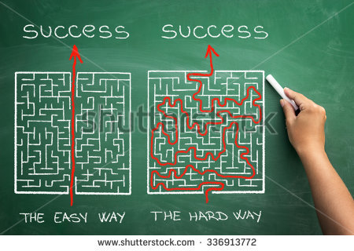

## LON0x12 Solution

An excellent CTF, well done to [@imhotepisinvisible](https://github.com/imhotepisinvisible) for crafting it and [@holocircuit](https://github.com/holocircuit) for winning! Although the explanations below may make some of these challenges seem simple, it is quite a different feeling to be presented with a succession of strange images, trying to work out what tools to bring to bear against them.

### starting_it_off.jpg


`exiftool` or `strings` are always safe bets on easy image challenges!

### a_little_trickier.jpg



The title hinted that you would need to run a few commands on the image (rather than going deep into its contents).

`binwalk` revealed appended zip data, and using `unzip` on the png was enough to solve as it automatically skips over bytes until it finds an archive header.

### now_what.png


This one was the hardest! Just a bunch of random (but low-range) colour pixels and a mysterious broken line. The column of pixels in the gap between the lines seemed significant, and it indeed was, however I stumbled on the trick mostly by accident.

The intuition was that each pixel's RGB values added up to a number in a range less than 128 and usually more than 40. So if you summed the RGBs, interpreted them as ASCII and paged through the output, you should find the flag. The nasty thing was that 99% of the pixels in the image were random; it was just the pixels in that narrow gap that were meaningful.

```python
from PIL import Image

image = Image.open("now_what.png")
w, h = image.size
im = image.load()

result = ""

for j in range(w):
    for i in range(h):
          r,g,b = im[j,i]
          result += chr(r+g+b)

ind = result.find("STL")

print result[ind:ind+29]
```

That looks clean but at the time lots of things were tried and plenty of grepping for 'STL' was involved...

### errr.png


This was a fluke solution for me. I printed out the top row of pixels and noticed it formed an interesting pattern. Flattening the values into a binary array, chunking into groups of 8 bits and converting to ASCII produced the flag. 

The clue tried to make you think in terms of LSBs; they were where the solution was hidden. But because the top line was black, meaning all bits besides the LSBs were 0 anyway, my ignorance didn't stop me. 

```python
from PIL import Image

image = Image.open("errr.png")
w, h = image.size
im = image.load()

out = []

for j in range(w):
    rgb = im[j,0]
    out += list(rgb)

def chunks(l, n):
    return (l[i:i+n] for i in xrange(0, len(l), n))

bit_chunks = [''.join(str(j) for j in i) for i in chunks(out, 8)]

result = [chr(int(i, 2)) for i in bit_chunks]

print(''.join(result))
```

### were_doing_gifs_now.gif


It's all black! Or is it? Printing out the pixel values showed binary values, with some non-black stuff in the middle. This didn't appear to be ASCII though. Furthermore, it wasn't visible! The challenge setter posted some diagrams about different image formats on the chat channel, which helped us know that there was some serious abuse of the Graphics Interchange Format going on here.

Reading an [in-depth description](http://giflib.sourceforge.net/whatsinagif/bits_and_bytes.html#global_color_table_block) of what a GIF is made of, the part about Global Colour Tables looked relevant. The image in question contains only two 'colours', 0 and 1, and these are actually indexes into two 3-byte fields near the top of the file, which are RGB values. Since the RGB values are all set to 00, everything appears black. Freshly armed with this information, what I did was:
 - Edit the image in vim's binary mode with `vim -b were_doing_gifs_now.gif`
 - Get the hexdump with `:%!xxd`
 - Go to the 15th byte (the green byte of index 0 since I like the colour green) and change from 00 to ff
 - Reverse the hexdump with `:%!xxd -r`
 - Display the flag with `:%!display`

Although you could more easily solve by editing the colourmap within GIMP for instance.

### now_what.gif


This one has noteworthy dimensions. The colours change at 7 pixel boundaries and it's 434 * 35, meaning there are (434 / 7) * (35 / 7) = 310 small squares in total. That's roughly the amount of binary data needed to store a flag.

First you need some code that will skip intervals of 7 pixels forward and gather all the data. Then you have to work out what to do with it. When you see the first 7 bits are 1010011 and know that S is 0x53 or 01010011 in ASCII, adding a leading bit to each chunk appears a prudent strategy.

I seemed incapable of writing working code quickly enough at this point but eventually just modified what I had for errr.png:

```python
from PIL import Image

image = Image.open('now_what.gif')
w, h = image.size
im = image.load()

out = []

for j in range(0,w,7):
    for i in range(0,h,7):
        out.append(im[j, i])

def chunks(l, n):
    return (l[i:i+n] for i in xrange(0, len(l), n))

chunked = [[0] + i for i in chunks(out, 7)]

result = [chr(int("".join(str(j) for j in i), 2)) for i in chunked]

print(''.join(result))
```
